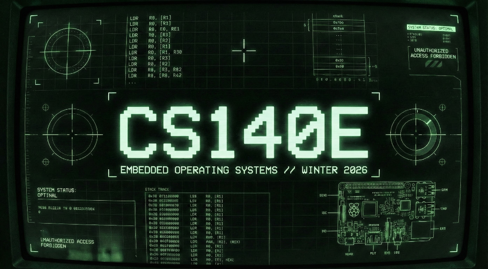

  

## CS140E: embedded operating systems (Engler, Winter, 2026)

Tl;dr:
  - 140E is a lab class, so [jump right to the labs](./labs/README.md).

CS140E is an introductory operating systems course.  This course differs
from most OS courses in that it uses real hardware instead of a fake
simulator, and almost all of the code will be written by you.

The class is tuned for people who love to hack.  It is designed to
go fast, and be real.  There are no lectures.  We do two labs a week,
starting at 530pm and going til you feel like leaving --- generally, at
least some staff will be here til midnight helping but you can (of course)
work whenever and wherever you want as long as you finish within a week.

By the end of the class you will have built your own simple, clean OS
for the widely-used, ARM-based [Raspberry Pi][raspberrypi] --- including
interrupts, threads, virtual memory, and a simple FAT32 file system.
Your OS should serve as a good base for interesting, real, sensor-based /
embedded projects.

We try to work directly with primary-sources (the Broadcom and ARMv6
manuals, various datasheets) since learning to understand such prose is
one of the super-powers of good systems hackers.  

After this quarter, you'll know/enact many cool things your peers do not.
You will also have a too-rare concrete understanding of how computation
works on real hardware.   This understanding will serve you in many other
contexts.  For what it is worth, everything you build will be stuff we
found personally useful.   There will be zero (intentional) busy-work.

If you're debating taking the class:
 - Here is [last year's class for reference][2025] 
 - [The wrap-up summary][2025-summary] should be especially useful.

We have an unusually strong and varied staff this year.  Should be a
fun quarter :)

- Head TA: Joseph Shetaye (rockets, booms, winning bets)
- TAs:
  - Maximilien Cura (Rust + insane hacks)
  - Aditya Sriram (ox64 riscv + bass)
- Section leads: (All: unpaid volunteers(!))
  - Rohan Ram Chanani + Asanshay Gupta (the GPU guys)
  - James Yu-tang Chen + Sai Ketan Konkimalla (the DOOM! guys)
  - Ron Dubinsky  (Paxos+networking)
  - Stuart Sul (ELF, real world, and top-tier AI)

  

------------------------------------------------------------------------
#### Who should take this class.

You should take this class if:

   1. You write systems code well OR (you don't yet write code well
      AND have a lot of time to devote to the class);
   2. AND you find these systems topics interesting.

The people that found the class valuable in the past were entirely drawn
from this demographic.  I would say that if you struggle building stuff
and are not already interested in the topic, then it's probably better
to take a different class.  I would particularly advise against taking
this class if you were looking for an easier way to satisfy a cs212 
requirement.

   1. It always helps, but you do not need any background in hardware
      or OS stuff to do well in the class.  In fact, you don't even need
      to have been trained in CS: one of the best students from the past
      was a physics PhD student with fairly minimal background in coding,
      so we've had fantastic luck with non-CS folks :) With that said,
      the less background you have, the more motivation you'll need.

      By the end of the class you'll have learned how to comfortably do
      many things that may well seem like superpowers and could easily
      serve you well for the next few decades.

   2. If you have background in the "embedded" space, it's worth taking
      b/c you'll learn a bunch of useful but not widely-known tricks
      (I'll pay for your supplies and a pitcher of beer if this claim
      turns out to be false!)

   3. It's also super fun.   The code you'll write can be used to
      as a basis for building many interesting systems.

With that said, I set aside the entire quarter to work on this course,
so am happy to help people that need it --- some of the biggest success
stories from past years were from students that had an initially large
gap between their understanding and the topic but started to really
"get it" after 4-5 weeks of struggle.

------------------------------------------------------------------------
### Lab policies.

Since we are short-staffed - you are strongly encouraged to help other
people!  We will try to keep a note of who does so effectively, and will
guarantee that you will be pushed up a grade if you are on the border.

   - You should be able to complete almost all of the lab in one sitting.
     If not, you *must* complete the lab within a week.  We will not
     accept a lab after this.

     We had a more flexible policy in the past.  Unfortunately, since
     labs typically build on each other, once people fell behind they
     got seriously lost.

   - To repeat: You *must* complete the lab within a week of it being
     issued.
   - To repeat: You *must* complete the lab within a week of it being
     issued.
   - To repeat: You *must* complete the lab within a week of it being
     issued.

   - PRELABS: Before each lab there will be some preparatory reading,
     which will typically include a short set of questions you need to
     answer and turn in *before* the lab begins.  This is an attempt
     to make the labs more information-dense by handling basic stuff
     outside of it, and focusing mostly on any tricky details in it.

   - You can leave lab at any time, but please either be there at the 
     start for when we discuss any important features of the night's
     lab or don't ask questions (we don't have the staff for O(n) 
     repeats).

------------------------------------------------------------------------
### What to do now.

First things first:

 1. clone the class repository:

       git clone git@github.com:dddrrreee/cs140e-26win.git

    You may need to install `git`, create a `github` account and register
    a key with github (if you don't want to do the latter, use the
    `http` clone method).  See the our [git instructions](guides/git.md)
    for more discussion.

 2. Look in the [docs](docs) directory to get a feel for what is there.

[cs212]: https://cs212.stanford.edu
[raspberrypi]: https://www.raspberrypi.org
[2025]: https://github.com/dddrrreee/cs140e-25win
[2025-summary]: https://github.com/dddrrreee/cs140e-25win/blob/main/labs/what-did-we-learn.md
[2024]: https://github.com/dddrrreee/cs140e-24win
[2023]: https://github.com/dddrrreee/cs140e-23win
[2022]: https://github.com/dddrrreee/cs140e-22win
[2021]: https://github.com/dddrrreee/cs140e-21spr
[2020]: https://github.com/dddrrreee/cs140e-20win
[2019]: https://github.com/dddrrreee/cs140e-win19
[2018]: https://cs140e.sergio.bz

  

