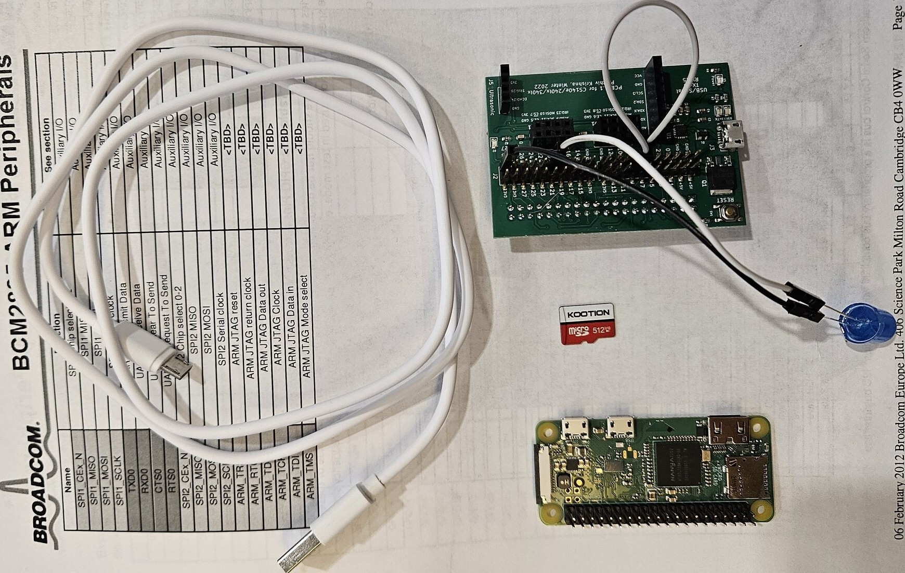

# Lab 2: some hardware + GPIO notes

**Stanford Winter 2026**

---
# Rules of pi fight club

What to do:
 - UNPLUG: if pi gets hot.
 - UNPLUG: if smell smoke, plastic burning, odd.
 - DON'T PUT on METAL!

/be me:
 - Cafe Barronne, metal tables.  Put pi on table to code:  No more pi.
 - Coffeebar. Copper-topped tables.  Put pi on table to code.  No more pi.
 - Coupa: silver metal tables.  Put pi on table to code.  No more pi.
 - Lesson in there.  Maybe more than one.
---

# Some quick fixes if pi stops working (I)

Quick checks:
 - check: SD card all the way in.  
 - check: USB all the way in.
 - retry (ideally: using other USB port).

Note: 
 - it's never the hardware
 - but sometimes it's the hardware.
 - today might be: likely 1 in 30 boards are bad.

---
# Differential debug: swap with partner

If theirs works: laptop issue.  
  1. Try different USB port.
  2. Maybe software / driver.

Otherwise: hardware issue. So start swapping with partner:
  - start with easy, then more involved.
  - next slide.

---
  

# Differential debug hardware

Swap: SD card (why: easy, safe)
  - Common: not fat32 formatted.  
  - Common: copied files into a subdirectory.

Swap: USB cable (also easy):
  - Might be charge only (no data-line).

Swap: pi itself (harder):
  - New: some failures expected

Swap: parthiv-board (harder):
  - New: some failures expected.
  - Also: both just pushed into pi: maybe bent, mis-aligned.

---
# Differential debug hardware

Note: 
  - If both of you are wrong: much harder to debug!
  - Will make you appreciate solving for one variable at a time :)
  - This class is about reducing many variables to one and solving.

---
# Differential debug hardware

Now you have a working system.  
 - Breaks in future?  30 sec.

Algorithm:
  - Swap with partner: still not work?  Laptop broke.
  - Otherwise: You know cable and microSD were correct.  
    - (So: Probably still correct.)
  - Push a new Parthiv into a new pi
    - (Or old pi into new parthiv, old parthiv into new pi)
  - Swap in your cable and microSD.
  - If one of these not work: lmk!

---
# How to keep a pi working

Pretty easy:
 - don't mess with it.  
 - don't constantly pull out SD card, USB cable,
    etc.  just leave it alone.  
 - we've had setups that worked for years.

---

# GPIO: our first datasheet

---
# GPIO

The pins sticking out of the pi.
  - also a bunch of other pins not exposed (needed for BT/wifi)
  - pin=1: 3.3V coming out.  (unless broken)
  - pin=0: 0.0V coming out.

How to config/write/read GPIO (or any device)?
 - old days: special instructions.
 - sucked: new device? need new instructions.
 - Better: instead "memory mapped"
 - give each device its private address range.
 - reads/writes/config: load/store to this range.

---

# General pattern of devices

magic addresses: no real rhyme or reason.
  - only rule: not shared with other devices.

magic values: no real rhyme or reason.
  - example: see GPIO "function select"
  - CPU does not interpret these values.

datasheet invariants:
   - passive definitional voice.
   - no examples. but plenty of errata and omissions!
   - wts: read 10 datasheet, 11th is no big deal.

---

---

---
# Example: how-to turn GPIO pin 20 on/off?

Config GPIO(20) as output?
 - p90: GFSEL2 `0x7E20_0008`.
 - p93: set GPSEL2.bits(0-2) = 0b001.  (output);

Turn GPIO(20) on?
 - p90: GPSET0 `0x7E20001C`
 - p95: set GPSET0.bit(i)=1

Turn GPIO pin(20) off?
 - p90: GPCLR0 = `0x7E200028`.
 - p95: set GPCLR0.bit(i)=1

---
  

# How to actually write?

Devices always have some bullshit:
 - BCM2835: Change  "bus address" to "physical address"
 - `0x7Exx xxxx` becomes `0x20xx xxxx`.  

How to actually set?
 - SET0: `*(volatile unsigned *)0x2020001C = 1`
 - CLR0: `*(volatile unsigned *)0x20200028 = 1`

For this class:
 - SET0: `PUT32(0x2020001C, 1)`
 - CLR0: `PUT32(0x20200028, 1)`
 - Definitions in assembly = compiler can't mess with.
 - Device access = fn call: enables tricks (lab 3).
---

# Datasheet will have superpowers.

If you care about a device: RTFM
 - Read the actual datasheet.
 - All libraries will squander many of the tricks.
 - You can win.

  

---

The hardare:
 - 1: microSD
 - 1: micro-usb cable 
 - 5-10: jumper wires.
 - 3-5: leds 
 - 1 pi
 - 1 parthiv: careful pushing together!

 
